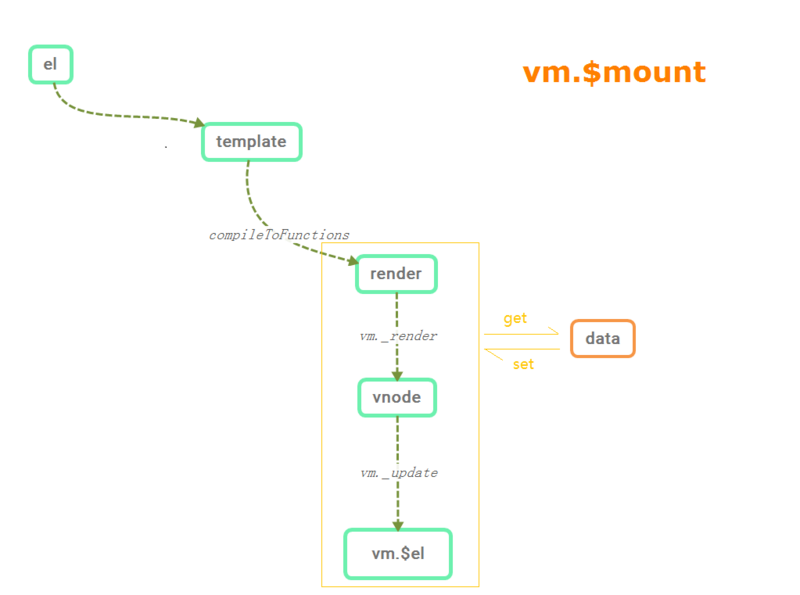

## Vue的模板编译器
Vue的渲染机制指的是Vue怎么将单文件组件中的template转换为AST(语法树)，再将AST转换成render函数，最后生成虚拟dom节点(包含创建元素节点的一切信息的JavaScript对象)，并创建元素节点挂载到页面上，基本过程如下图:

本节先介绍模板编译生成render函数的过程。
### 模板编译过程
模板编译成渲染函数经历了三个阶段: 将模板解析成AST、遍历AST标记静态节点以及静态根节点和使用AST生成render函数。
以下面模板为例:
```
<div id="app">{{ message }}</div>
```
首先获取组件的模板内容
```
var template = options.template;
    if (template) {
        // 针对字符串模板和选择符匹配模板
    if (typeof template === 'string') {
        // 选择符匹配模板，以'#'为前缀的选择符
        if (template.charAt(0) === '#') {
            // 获取匹配元素的innerHTML
            template = idToTemplate(template);
        }
    } else if (template.nodeType) {
        // 针对DOM元素匹配，获取匹配元素的innerHTML
        template = template.innerHTML;
    } else {
        {
        warn('invalid template option:' + template, this);
        }
        return this
    }
    } else if (el) {
        // 如果没有传入template模板，则默认以el元素所属的根节点作为基础模板
    template = getOuterHTML(el);
}
```
获取模板后处理的核心过程如下:
```
compileToFunctions(template, {
    outputSourceRange: "development" !== 'production',
    shouldDecodeNewlines: shouldDecodeNewlines,
    shouldDecodeNewlinesForHref: shouldDecodeNewlinesForHref,
    delimiters: options.delimiters,
    comments: options.comments
}, this)
...
var compiled = compile(template, options);
...
var compiled = baseCompile(template.trim(), finalOptions);
```
上面的代码是在创建编译器，真正的编译过程: 解析、优化以及生成render函数，代码如下:
```
var ast = parse(template.trim(), options);
if (options.optimize !== false) {
    optimize(ast, options);
}
var code = generate(ast, options);
```
### template解析
真正的解析函数是parseHTML，它的参数是template，和一个options对象，这个对象包含了start、end、chars以及comment对标签处理的函数:
```
parseHTML(template, {
      warn: warn$2,
      expectHTML: options.expectHTML,
      isUnaryTag: options.isUnaryTag,
      canBeLeftOpenTag: options.canBeLeftOpenTag,
      shouldDecodeNewlines: options.shouldDecodeNewlines,
      shouldDecodeNewlinesForHref: options.shouldDecodeNewlinesForHref,
      shouldKeepComment: options.comments,
      outputSourceRange: options.outputSourceRange,
      // 处理起始标签
      start: function start (tag, attrs, unary, start$1, end) {
        ...
        var element = createASTElement(tag, attrs, currentParent);
        ...
      },
      // 用来处理结束标签
      end: function end (tag, start, end$1) {
        var element = stack[stack.length - 1];
        // pop stack
        stack.length -= 1;
        currentParent = stack[stack.length - 1];
        if (options.outputSourceRange) {
          element.end = end$1;
        }
        closeElement(element);
      },
      // 用来处理文本
      chars: function chars (text, start, end) {
        ...
      },
      // 处理评论内容
      comment: function comment (text, start, end) {
        // adding anyting as a sibling to the root node is forbidden
        // comments should still be allowed, but ignored
        if (currentParent) {
          var child = {
            type: 3,
            text: text,
            isComment: true
          };
          if (options.outputSourceRange) {
            child.start = start;
            child.end = end;
          }
          currentParent.children.push(child);
        }
      }
    });
    return root
}
```
parseHTML函数核心内容为:
```
while (html) {
      last = html;
      // Make sure we're not in a plaintext content element like script/style
      //  父元素为正常元素
      if (!lastTag || !isPlainTextElement(lastTag)) {
        var textEnd = html.indexOf('<');
        // html以标签开头
        if (textEnd === 0) {
          // Comment:
          if (comment.test(html)) {
            var commentEnd = html.indexOf('-->');

            if (commentEnd >= 0) {
              if (options.shouldKeepComment) {
                options.comment(html.substring(4, commentEnd), index, index + commentEnd + 3);
              }
              advance(commentEnd + 3);
              continue
            }
          }

          // Doctype:
          var doctypeMatch = html.match(doctype);
          if (doctypeMatch) {
            advance(doctypeMatch[0].length);
            continue
          }

          // End tag: 处理结束标签
          ...

          // Start tag:
          // 解析起始标签
          ...
        }
        ...
      } else {
          // 父元素为script、style、textarea的处理逻辑
          ...
      }

      if (html === last) {
        options.chars && options.chars(html);
        if (!stack.length && options.warn) {
          options.warn(("Mal-formatted tag at end of template: \"" + html + "\""), { start: index + html.length });
        }
        break
      }
    }
```
基本过程如下:
1. `html=<div id="app">{{ message }}</div>`首先获取textEnd === 0，接下来可判断html是以div标签起始的，进行parseStartTag处理
```
var startTagMatch = parseStartTag();
if (startTagMatch) {
    // 对获取起始标签的属性，生成键值对
    handleStartTag(startTagMatch);
    if (shouldIgnoreFirstNewline(startTagMatch.tagName, html)) {
        advance(1);
    }
    continue
}
```
返回对象为
```
{
    attrs: [" id="app"", "id", "=", "app", undefined, undefined, index: 0, input: " id="app">{{ message }}<button @click="update">更新</button></div>", groups: undefined, start: 4, end: 13],
    end: 14,
    start: 0,
    tagName: "div",
    unarySlash: ""
}
```
其中unarySlash表示是否是闭合标签。在经过handleStartTag函数处理后调用start函数
```
if (!unary) {
    stack.push({ tag: tagName, lowerCasedTag: tagName.toLowerCase(), attrs: attrs,start: match.start, end: match.end });
    lastTag = tagName;
}
// 上面根据parseStartTag返回的对象生成attrs
if (options.start) {
    options.start(tagName, attrs, unary, match.start, match.end);
}
```
options.start函数处理后生成
```
{attrsList: [{
    end: 13
    name: "id"
    start: 5
    value: "app"
}],
attrsMap: {id: "app"},
children: [],
end: 14,
parent: undefined,
rawAttrsMap: {id: {name: "id", value: "app", start: 5, end: 13}},
start: 0,
tag: "div",
type: 1}
```
先判断标签是否是闭合标签，如果是的话直接closeElement，不是的话，更新currentParent并且将当前元素推入stack栈。
```
if (!unary) {
    currentParent = element;
    stack.push(element);
} else {
    closeElement(element);
}
```
需要注意的是: stack栈的作用是维护DOM的层级，防止HTML标签的不匹配。
2. 这个while的第一次循环结束，html被截取为`{{ message }}</div>`，此时计算textEnd为13，此时处理的是文本元素
```
// 为文本节点
var text = (void 0), rest = (void 0), next = (void 0);
if (textEnd >= 0) {
    rest = html.slice(textEnd);
    while (
    !endTag.test(rest) &&
    !startTagOpen.test(rest) &&
    !comment.test(rest) &&
    !conditionalComment.test(rest)
    ) {
    // < in plain text, be forgiving and treat it as text
    next = rest.indexOf('<', 1);
    if (next < 0) { break }
    textEnd += next;
    rest = html.slice(textEnd);
    }
    text = html.substring(0, textEnd);
}

if (textEnd < 0) {
    text = html;
}

if (text) {
    advance(text.length);
}

if (options.chars && text) {
    options.chars(text, index - text.length, index);
}
```
此时rest = `</div>`, text = `{{ message }}`，由 options.chars函数处理文本，具体代码为
```
...
var children = currentParent.children;
...
if (text) {
    if (!inPre && whitespaceOption === 'condense') {
        // condense consecutive whitespaces into single space
        text = text.replace(whitespaceRE$1, ' ');
    }
    var res;
    var child;
    // 带变量的文本节点, type = 2
    if (!inVPre && text !== ' ' && (res = parseText(text, delimiters))) {
        child = {
            type: 2,
            expression: res.expression,
            tokens: res.tokens,
            text: text
        };
    } else if (text !== ' ' || !children.length || children[children.length - 1].text !== ' ') {
        // 不带变量的文本节点,type = 3
        child = {
            type: 3,
            text: text
        };
    }
    if (child) {
        if (options.outputSourceRange) {
            child.start = start;
            child.end = end;
        }
        children.push(child);
    }
}
```
经由parseText函数
```
function parseText (
    text,
    delimiters
  ) {
      // 匹配 {{ message }}
    var tagRE = delimiters ? buildRegex(delimiters) : defaultTagRE;
    if (!tagRE.test(text)) {
      return
    }
    var tokens = [];
    var rawTokens = [];
    var lastIndex = tagRE.lastIndex = 0;
    var match, index, tokenValue;
    while ((match = tagRE.exec(text))) {
      index = match.index;
      // push text token
      // 把{{左边的文本内容添加到tokens中
      if (index > lastIndex) {
        rawTokens.push(tokenValue = text.slice(lastIndex, index));
        tokens.push(JSON.stringify(tokenValue));
      }
      // tag token
      // 将 {{ message }} 转成 _s(message) 添加到数组
      var exp = parseFilters(match[1].trim());
      tokens.push(("_s(" + exp + ")"));
      rawTokens.push({ '@binding': exp });
      lastIndex = index + match[0].length;
    }
    // 把{{右边的文本内容添加到tokens中
    if (lastIndex < text.length) {
      rawTokens.push(tokenValue = text.slice(lastIndex));
      tokens.push(JSON.stringify(tokenValue));
    }
    return {
      expression: tokens.join('+'),
      tokens: rawTokens
    }
  }
```
处理后返回
```
{
    expression: "_s(message)",
    tokens: [{@binding: "message"}]
}
```
将该节点push进children，生成
```
[
    {
        end: 27,
        expression: "_s(message)",
        start: 14,
        text: "{{ message }}",
        tokens: [{@binding: "message"}],
        type: 2
    }
]
```
3. 第三轮循环时html为`</div>`，计算的textEnd = 0，匹配到结束标签
```
var endTagMatch = html.match(endTag);
if (endTagMatch) {
    var curIndex = index;
    advance(endTagMatch[0].length);
    parseEndTag(endTagMatch[1], curIndex, index);
    continue
}
```
endTagMatch为
```
[
    "</div>", "div", groups: undefined, index: 0, input: "</div>"
]
```
栈进行遍历，寻找与当前结束标签匹配的起始标签，options.end函数处理
```
var element = stack[stack.length - 1];
// pop stack
stack.length -= 1;
currentParent = stack[stack.length - 1];
if (options.outputSourceRange) {
    element.end = end$1;
}
closeElement(element);
```
将栈中的元素pop出，currentParent为栈的顶层第一个元素element, 更新元素element的end属性，在进行closeElement主要代码为:
```
// 对元素的属性进行处理，如ref，slot，is，attrs
if (!inVPre && !element.processed) {
    element = processElement(element, options);
}
...
// 将父子关系确认好
if (currentParent && !element.forbidden) {
    if (element.elseif || element.else) {
        processIfConditions(element, currentParent);
    } else {
    if (element.slotScope) {
        // scoped slot
        // keep it in the children list so that v-else(-if) conditions can
        // find it as the prev node.
        var name = element.slotTarget || '"default"'
        ;(currentParent.scopedSlots || (currentParent.scopedSlots = {}))[name] = element;
        }
        // 将当前元素推入到当前父节点的children数组中，更新当前元素的父元素
        currentParent.children.push(element);
        element.parent = currentParent;
    }
}
```
生成的AST为
```
{
    attrs: [{
        dynamic: undefined
        end: 13
        name: "id"
        start: 5
        value: ""app""
    }]
    attrsList: [{name: "id", value: "app", start: 5, end: 13}]
    attrsMap: {id: "app"}
    children: [{
        end: 27,
        expression: "_s(message)",
        start: 14,
        text: "{{ message }}",
        tokens: [{@binding: "message"}],
        type: 2
    }]
    end: 33
    parent: undefined
    plain: false
    rawAttrsMap: {id: {name: "id", value: "app", start: 5, end: 13}}
    start: 0
    tag: "div"
    type: 1
}
```
最后再更新stack和lastTag，stack=[],lastTag='div'，循环结束，返回root这个生成的ast。
### 优化器
接下来进入优化阶段，
```
optimize(ast, options);
// 生成静态节点以及静态根节点
function optimize (root, options) {
    if (!root) { return }
    isStaticKey = genStaticKeysCached(options.staticKeys || '');
    isPlatformReservedTag = options.isReservedTag || no;
    // first pass: mark all non-static nodes.
    markStatic$1(root);
    // second pass: mark static roots.
    markStaticRoots(root, false);
  }
```
首先给ast标记非静态节点
```
function markStatic$1 (node) {
    // 先判断该节点是否是静态节点
    node.static = isStatic(node);
    if (node.type === 1) {
      // do not make component slot content static. this avoids
      // 1. components not able to mutate slot nodes
      // 2. static slot content fails for hot-reloading
      if (
        !isPlatformReservedTag(node.tag) &&
        node.tag !== 'slot' &&
        node.attrsMap['inline-template'] == null
      ) {
        return
      }
      for (var i = 0, l = node.children.length; i < l; i++) {
        var child = node.children[i];
        // 递归子节点标记静态节点
        markStatic$1(child);
        // 如果子节点打完标记后，判断子节点是否是静态节点，如果不是，则父节点node不可能是静态节点，此时需将父节点设置static = false
        if (!child.static) {
          node.static = false;
        }
      }
      ...
    }
}
```
判断是否是静态节点的函数
```
function isStatic (node) {
    if (node.type === 2) { // expression，表达式
      return false
    }
    if (node.type === 3) { // text 文本节点
      return true
    }
    // 如果元素节点没有v-pre，必须同时满足
    return !!(node.pre || (
      !node.hasBindings && // no dynamic bindings
      !node.if && !node.for && // not v-if or v-for or v-else
      !isBuiltInTag(node.tag) && // not a built-in 内置标签，如slot、component
      isPlatformReservedTag(node.tag) && // not a component，必须是保留标签，<list></list>就不是保留标签
      !isDirectChildOfTemplateFor(node) && // 当前节点的父节点不能是带v-for指令的template标签
      Object.keys(node).every(isStaticKey) // 
    ))
  }
```
接着找出所有的静态根节点并标记
```
// second pass: mark static roots.
markStaticRoots(root, false);
```
具体为
```
function markStaticRoots (node, isInFor) {
    if (node.type === 1) {
      if (node.static || node.once) {
        node.staticInFor = isInFor;
      }
      // For a node to qualify as a static root, it should have children that
      // are not just static text. Otherwise the cost of hoisting out will
      // outweigh the benefits and it's better off to just always render it fresh.
      // 对于静态根节点，必须有子节点，且子节点不能只是一个静态文本节点
      if (node.static && node.children.length && !(
        node.children.length === 1 &&
        node.children[0].type === 3
      )) {
        node.staticRoot = true;
        return
      } else {
        node.staticRoot = false;
      }
      // 递归子节点
      if (node.children) {
        for (var i = 0, l = node.children.length; i < l; i++) {
          markStaticRoots(node.children[i], isInFor || !!node.for);
        }
      }
      ...
    }
  }
```
返回的AST为:
```
{
    attrs: [{
        dynamic: undefined
        end: 13
        name: "id"
        start: 5
        value: ""app""
    }]
    attrsList: [{name: "id", value: "app", start: 5, end: 13}]
    attrsMap: {id: "app"}
    children: [{
        end: 27,
        expression: "_s(message)",
        start: 14,
        static: false,
        text: "{{ message }}",
        tokens: [{@binding: "message"}],
        type: 2
    }]
    end: 33
    parent: undefined
    plain: false,
    rawAttrsMap: {id: {name: "id", value: "app", start: 5, end: 13}}
    start: 0,
    static: false,
    staticRoot: false,
    tag: "div",
    type: 1
}
```
### 代码生成器
作用将ast生成render渲染函数，不同的节点生成的方式不一样，具体代码如下:
```
function generate (
    ast,
    options
  ) {
    var state = new CodegenState(options);
    var code = ast ? genElement(ast, state) : '_c("div")';
    return {
      render: ("with(this){return " + code + "}"),
      staticRenderFns: state.staticRenderFns
    }
  }
```
先判断ast是否存在，不存在默认是_c('div')，_c表示
```
vm._c = function (a, b, c, d) { return createElement(vm, a, b, c, d, false); };
```
存在则对ast具体处理
```
function genElement (el, state) {
    if (el.parent) {
      el.pre = el.pre || el.parent.pre;
    }
    // 处理静态节点
    if (el.staticRoot && !el.staticProcessed) {
      return genStatic(el, state)
    } else if (el.once && !el.onceProcessed) {
        // 处理v-once指令
      return genOnce(el, state)
    } else if (el.for && !el.forProcessed) {
        // 处理v-for指令
      return genFor(el, state)
    } else if (el.if && !el.ifProcessed) {
        // 处理v-if指令
      return genIf(el, state)
    } else if (el.tag === 'template' && !el.slotTarget && !state.pre) {
        // 处理template标签
      return genChildren(el, state) || 'void 0'
    } else if (el.tag === 'slot') {
        // 处理slot内置组件
      return genSlot(el, state)
    } else {
      // component or element
      var code;
      if (el.component) {
          // 处理组件
        code = genComponent(el.component, el, state);
      } else {
        var data;
        // 处理元素
        if (!el.plain || (el.pre && state.maybeComponent(el))) {
          data = genData$2(el, state);
        }
        // 生成子节点的render函数部分
        var children = el.inlineTemplate ? null : genChildren(el, state, true);
        code = "_c('" + (el.tag) + "'" + (data ? ("," + data) : '') + (children ? ("," + children) : '') + ")";
      }
      // module transforms
      for (var i = 0; i < state.transforms.length; i++) {
        code = state.transforms[i](el, code);
      }
      return code
    }
  }
```
进入genData$2函数为
```
function genData$2 (el, state) {
    var data = '{';

    // directives first.
    // directives may mutate the el's other properties before they are generated.
    var dirs = genDirectives(el, state);
    if (dirs) { data += dirs + ','; }

    // key
    if (el.key) {
      data += "key:" + (el.key) + ",";
    }
    // ref
    if (el.ref) {
      data += "ref:" + (el.ref) + ",";
    }
    if (el.refInFor) {
      data += "refInFor:true,";
    }
    // pre
    if (el.pre) {
      data += "pre:true,";
    }
    // record original tag name for components using "is" attribute
    if (el.component) {
      data += "tag:\"" + (el.tag) + "\",";
    }
    // module data generation functions
    for (var i = 0; i < state.dataGenFns.length; i++) {
      data += state.dataGenFns[i](el);
    }
    // attributes，更新attrs的属性形式
    if (el.attrs) {
      data += "attrs:" + (genProps(el.attrs)) + ",";
    }
    // DOM props
    if (el.props) {
      data += "domProps:" + (genProps(el.props)) + ",";
    }
    // event handlers
    if (el.events) {
      data += (genHandlers(el.events, false)) + ",";
    }
    if (el.nativeEvents) {
      data += (genHandlers(el.nativeEvents, true)) + ",";
    }
    // slot target
    // only for non-scoped slots
    if (el.slotTarget && !el.slotScope) {
      data += "slot:" + (el.slotTarget) + ",";
    }
    // scoped slots
    if (el.scopedSlots) {
      data += (genScopedSlots(el, el.scopedSlots, state)) + ",";
    }
    // component v-model
    if (el.model) {
      data += "model:{value:" + (el.model.value) + ",callback:" + (el.model.callback) + ",expression:" + (el.model.expression) + "},";
    }
    // inline-template
    if (el.inlineTemplate) {
      var inlineTemplate = genInlineTemplate(el, state);
      if (inlineTemplate) {
        data += inlineTemplate + ",";
      }
    }
    data = data.replace(/,$/, '') + '}';
    // v-bind dynamic argument wrap
    // v-bind with dynamic arguments must be applied using the same v-bind object
    // merge helper so that class/style/mustUseProp attrs are handled correctly.
    if (el.dynamicAttrs) {
      data = "_b(" + data + ",\"" + (el.tag) + "\"," + (genProps(el.dynamicAttrs)) + ")";
    }
    // v-bind data wrap
    if (el.wrapData) {
      data = el.wrapData(data);
    }
    // v-on data wrap
    if (el.wrapListeners) {
      data = el.wrapListeners(data);
    }
    return data
  }
```
其功能就是拼接字符串，先给data赋值一个'{', 然后发现节点有哪些属性就将其拼接到data，最后加上一个'}'，最后返回一个完整得data:
```
"{attrs:{"id":"app"}}"
```
接着对元素节点的子节点进行处理
```
genChildren(el, state, true);
```
具体函数为:
```
function genChildren (
    el,
    state,
    checkSkip,
    altGenElement,
    altGenNode
  ) {
    var children = el.children;
    if (children.length) {
        ...
      var gen = altGenNode || genNode;
      return ("[" + (children.map(function (c) { return gen(c, state); }).join(',')) + "]" + (normalizationType$1 ? ("," + normalizationType$1) : ''))
    }
  }

```
根据不同子节点类型生成不同的节点字符串将其拼接在一起，genNode函数为:
```
function genNode (node, state) {
    if (node.type === 1) {
      return genElement(node, state)
    } else if (node.type === 3 && node.isComment) {
      return genComment(node)
    } else {
      return genText(node)
    }
  }
```
递归子节点来生成子节点的子节点，最后拼接到一起返回。文本节点的处理
```
function genText (text) {
    return ("_v(" + (text.type === 2
      ? text.expression // no need for () because already wrapped in _s()
      : transformSpecialNewlines(JSON.stringify(text.text))) + ")")
  }
```
动态文本使用express表达式，静态文本用text，把文本放在_v中作为参数，生成的code即render函数为:
```
"_c('div',{attrs:{"id":"app"}},[_v(_s(message))])"
```
最后由
```
updateComponent = function () {
    vm._update(vm._render(), hydrating);
};
```
中的vm._render()函数调用生成VNode，代码为
```
 vnode = render.call(vm._renderProxy, vm.$createElement);
```
调用生成的render函数，指向vm._renderProxy，with语句的作用是将代码的作用域设置到一个特定的作用域this中，调用后进入如下:
```
with(this){return _c('div',{attrs:{"id":"app"}},[_v(_s(message))])}
```
其中_s表示toString(),生成的VNode为
```
{
    asyncFactory: undefined
    asyncMeta: undefined
    children: [
    {
        asyncFactory: undefined,
        asyncMeta: undefined,
        children: undefined,
        componentInstance: undefined,
        componentOptions: undefined,
        context: undefined,
        data: undefined,
        elm: undefined,
        fnContext: undefined,
        fnOptions: undefined,
        fnScopeId: undefined,
        isAsyncPlaceholder: false,
        isCloned: false,
        isComment: false,
        isOnce: false,
        isRootInsert: true,
        isStatic: false,
        key: undefined
        ns: undefined,
        parent: undefined,
        raw: false,
        tag: undefined,
        text: "Hello Wolrd",
        child: undefined
    }],
    componentInstance: undefined
    componentOptions: undefined
    context: Vue {_uid: 0, _isVue: true, $options: {…}, _renderProxy: Proxy, _self: Vue, …}
    data: {attrs: {id: 'app'}}
    elm: undefined,
    fnContext: undefined,
    fnOptions: undefined,
    fnScopeId: undefined,
    isAsyncPlaceholder: false,
    isCloned: false,
    isComment: false,
    isOnce: false,
    isRootInsert: true,
    isStatic: false,
    key: undefined,
    ns: undefined,
    parent: undefined,
    raw: false,
    tag: "div",
    text: undefined,
    child: undefined
}
```
此时编译过程结束，下篇介绍VNode的渲染过程。