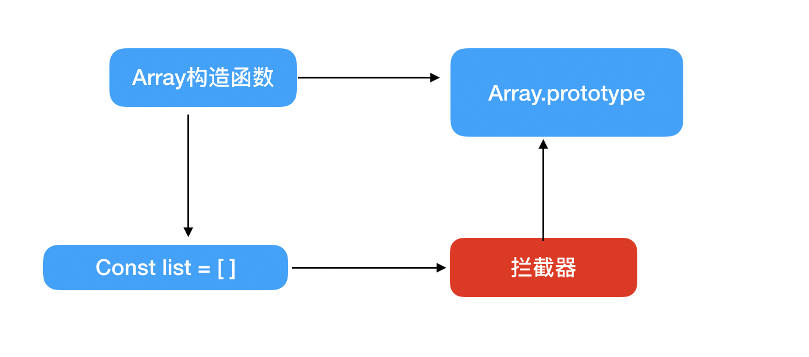
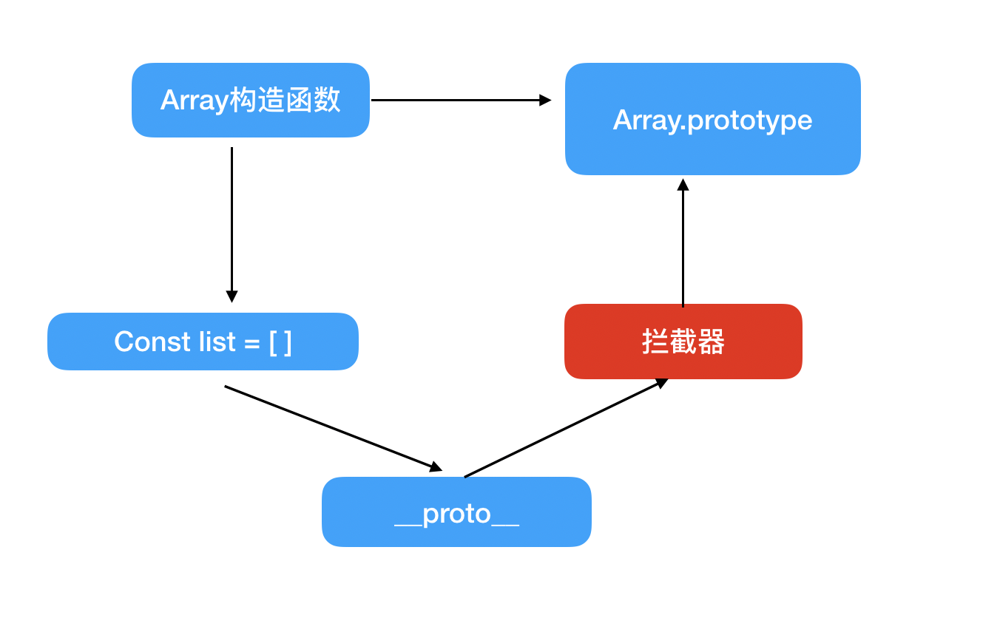

## Array的变化侦测
### 数组如何追踪变化
Object通过setter来追踪，只要数据发生变化，一定会触发setter;如果使用push来改变数组内容，只要在进行push操作的时候得到通知，就能达到同样目的，但是es6之前，并没有提供可以拦截原型方法的能力，故可以考虑用拦截器覆盖Array.prototype，相当于执行Array的原型方法就相当于执行拦截其中提供的方法，如下图：


### 拦截器
拦截器就是一个跟Array.prototype一样的Object，只是这个Object中可以改变数组内容的方法是处理过的，Array中可以改变数组自身内容的方法有7个['push','pop','shift','unshift','splice','sort','reverse']
```
['push','pop','shift','unshift','splice','sort','reverse']
.forEach(method => {
    const original = arrayProto[method]
    Object.defineProperty(arrayMethods, method, {
        value: function mutator (...args) {
            console.log('数组拦截操作, 变化通知')
            return original.call(this, args)
        },
        enumerable: false,
        writable: true,
        configurable: true
    })
})
```

### 使用拦截器覆盖Array原型
在转换data为响应式数据时，遇到数组类型，将该数组的array原型覆盖掉
```
class Observer {
    constructor (value) {
        if (Array.isArray(value)) {
            value.__proto__ = arrayMethods
        } else {
            this.walk(value)
        }
    }
}
```
其示意图:


### 将拦截器的方法挂载到数组的属性上
vue的内部是先判断__proto__是否存在，不存在就直接挂载
```
var Observer = function Observer (value) {
    this.value = value;
    this.dep = new Dep();
    this.vmCount = 0;
    def(value, '__ob__', this);
    if (Array.isArray(value)) {
      if (hasProto) {
        // 使用protoAugment覆盖原型
        protoAugment(value, arrayMethods);
      } else {
        // 在数组上挂载一些方法
        copyAugment(value, arrayMethods, arrayKeys);
      }
      // 侦测array中的每一项
      this.observeArray(value);
    } else {
      this.walk(value);
    }
  };
```
### 如何收集依赖
收集依赖的地方还是在defineReactive$$方法的get方法，因为data中的数组元素arr，还是需要通过this.arr获取后再进行数组操作。
### 依赖列表
依赖列表存在于Observer构造函数中，这个依赖保存的位置getter和拦截器中都可以取到
```
var Observer = function Observer (value) {
    this.value = value;
    this.dep = new Dep();
    this.vmCount = 0;
    def(value, '__ob__', this);
    ...
  };
```
通过value.__ob__来访问Observer实例，同时__ob__可以用来标记当前的value是否已经被转换成响应式数据。
这样在收集依赖的时候，可以在getter中访问,将依赖收集到Observer实例的dep中，即数组收集依赖:
```
function defineReactive$$1 (
    obj,
    key,
    val,
    customSetter,
    shallow
  ) {
    var dep = new Dep();
    ...
    // 递归，当data中存在array数据时返回的实例
    var childOb = !shallow && observe(val);
    Object.defineProperty(obj, key, {
      enumerable: true,
      configurable: true,
      get: function reactiveGetter () {
        var value = getter ? getter.call(obj) : val;
        if (Dep.target) {
          dep.depend();
          if (childOb) {
            // 数组收集依赖
            childOb.dep.depend();
            if (Array.isArray(value)) {
              dependArray(value);
            }
          }
        }
        return value
      },
      set: function reactiveSetter (newVal) {
        ...
        dep.notify();
      }
    });
  }

```
### 侦测新增元素的变化
```
var arrayProto = Array.prototype;
  var arrayMethods = Object.create(arrayProto);

  var methodsToPatch = [
    'push',
    'pop',
    'shift',
    'unshift',
    'splice',
    'sort',
    'reverse'
  ];

  /**
   * Intercept mutating methods and emit events
   */
  methodsToPatch.forEach(function (method) {
    // cache original method
    var original = arrayProto[method];
    def(arrayMethods, method, function mutator () {
      var args = [], len = arguments.length;
      while ( len-- ) args[ len ] = arguments[ len ];
      // 缓存原始方法
      var result = original.apply(this, args);
      //  获取到Observer实例
      var ob = this.__ob__;
      var inserted;
      switch (method) {
        case 'push':
        case 'unshift':
          inserted = args;
          break
        case 'splice':
          inserted = args.slice(2);
          break
      }
      // 新增
      if (inserted) { ob.observeArray(inserted); }
      // 向依赖发送数据
      ob.dep.notify();
      return result
    });
  });

```
将新增的元素暂存在inserted中，再使用Observer把inserted中的元素转成响应式的。